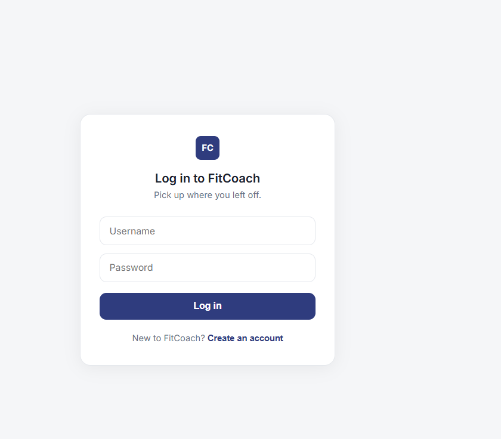
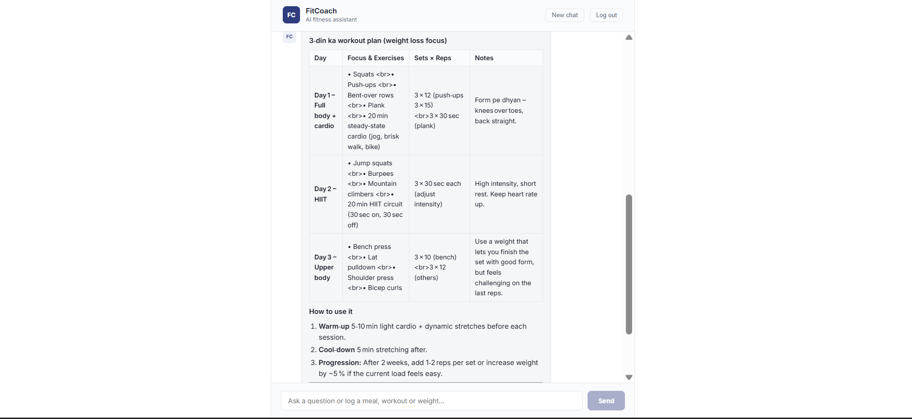

# FitCoach

**Your personal AI fitness and nutrition coach, in a simple chat.**

## Overview

FitCoach is a web app that works like a personal trainer you can message anytime. You create an account, tell the coach about yourself and your goal, and then just talk to it: ask how many calories you should eat, get a weekly workout plan, tell it what you ate or how you trained, check your progress, or ask it to remind you about something every day.

You can talk to it in English or Roman Urdu, the same way you would text a friend.

## Aim

Many people start a fitness routine and give up within a few weeks, because tracking food and workouts feels like a chore and online advice rarely fits their situation. FitCoach aims to:

- Make tracking as easy as sending a message.
- Give advice that fits the user's own body, goal and daily routine.
- Base calorie and workout guidance on trusted methods, not guesswork.
- Stay safe, by recognising health concerns and suggesting a doctor instead of giving risky advice.

## Benefits

- **Easy to use:** no long forms or complicated menus; just type what you want.
- **Personal:** every plan and number is based on your own profile and goal.
- **Keeps track for you:** meals, workouts and weight are saved, so your progress is always one question away.
- **Remembers you:** log out, come back tomorrow, and the coach picks up where you left off.
- **Private:** each person's data is kept separate and protected by their own login.
- **Safe:** it never encourages extreme dieting and points you to a professional when something sounds medical.

## Key features

- Chat-based coaching in English and Roman Urdu
- Daily calorie target with protein, carbs and fat breakdown
- Weekly workout plans for weight loss, muscle gain or general fitness (1 to 6 days a week)
- Meal, workout and weight logging
- Progress summary for the past week
- Daily reminders at a time you choose
- Health-safety checks before giving advice
- Secure personal accounts
- "New chat" to start fresh while keeping your saved progress

## Screenshots

**Login**

**Dashboard**

## Architecture

## Disclaimer

FitCoach gives general fitness information and is not a substitute for a doctor, dietitian or certified trainer.