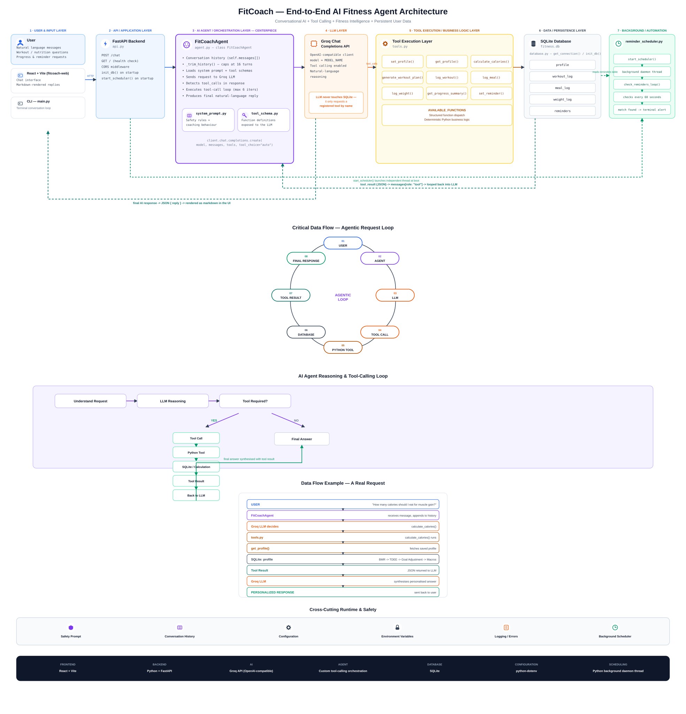

# FitCoach — AI Fitness & Diet Coach

FitCoach is an AI-powered fitness and nutrition coaching agent built with a Python/FastAPI backend, a Groq-hosted LLM (Llama 3.3), and a React + Vite web frontend. It calculates calories and macros, generates workout plans, tracks progress, sets reminders, and follows a strict medical-safety protocol — while remaining honest about its limitations as an AI, not a licensed trainer or doctor.

## Architecture



The agent follows a tool-calling loop: the user's message reaches the LLM through `agent.py`, the LLM decides whether a registered Python tool is needed, `tools.py` executes real business logic against `fitness.db`, and the result is passed back to the LLM to produce the final natural-language reply.

## Features

- **Profile management** — name, age, height, weight, goal, activity level
- **Calorie & macro calculator** — BMR/TDEE via the Mifflin-St Jeor formula
- **Workout plan generator** — weekly split based on goal (loss / muscle gain / general fitness)
- **Progress tracking** — workout logs, meal logs, weight history
- **Reminders** — background scheduler checks and alerts at the right time
- **Medical safety protocol** — if any medical hint appears, the agent pauses, asks a clarifying question, and refuses to give specific advice until the person is cleared or referred to a professional
- **Web chat interface** — clean, professional UI with full Markdown rendering (tables, bold, lists)

## Tech Stack

| Layer | Technology |
|---|---|
| Frontend | React + Vite |
| Backend | Python + FastAPI |
| AI | Groq API (OpenAI-compatible client) |
| Agent orchestration | Custom Python tool-calling loop |
| Database | SQLite |
| Configuration | python-dotenv |
| Scheduling | Python background daemon thread |

## Project Structure

```
fitcoach/
├── main.py                 # CLI entry point (terminal chat)
├── api.py                  # FastAPI backend (web entry point)
├── agent.py                # FitCoachAgent — core reasoning/tool-calling loop
├── tools.py                # Real Python functions (calorie calc, logging, etc.)
├── tool_schema.py           # Tool definitions exposed to the LLM
├── system_prompt.py          # Agent personality + safety rules
├── database.py                # SQLite connection + table setup
├── reminder_scheduler.py       # Background thread for reminders
├── requirements.txt             # Python dependencies
├── .env.example                  # Environment variable template
├── assets/
│   └── fitcoach_infographic.svg   # Architecture diagram
└── fitcoach-web/                   # React + Vite frontend
    ├── src/
    │   ├── App.jsx
    │   └── App.css
    └── package.json
```

## Setup

### Backend

```bash
cd fitcoach
pip install -r requirements.txt
```

Create a `.env` file (copy `.env.example`) and add your Groq API key:

```
GROQ_API_KEY=your_key_here
```

Run the web backend:

```bash
uvicorn api:app --host 0.0.0.0 --port 8000
```

Or run the CLI version:

```bash
python main.py
```

### Frontend

```bash
cd fitcoach-web
npm install
npm run dev
```

Open `http://localhost:5173` in your browser (make sure the backend is running on port 8000).

## API

| Endpoint | Method | Description |
|---|---|---|
| `/` | GET | Health check |
| `/chat` | POST | Send a message, receive the agent's reply — `{ "message": "..." }` |

## Important Notes

- This agent is **not a replacement for a certified trainer or doctor**. It gives general fitness/nutrition guidance and defers to professionals for anything medical.
- Conversation history is trimmed to the last 16 messages to stay within the LLM provider's rate limits.
- SQLite data (`fitness.db`) persists locally; it is not committed to version control (see `.gitignore`).

## License

This project is provided as-is for personal and educational use.
