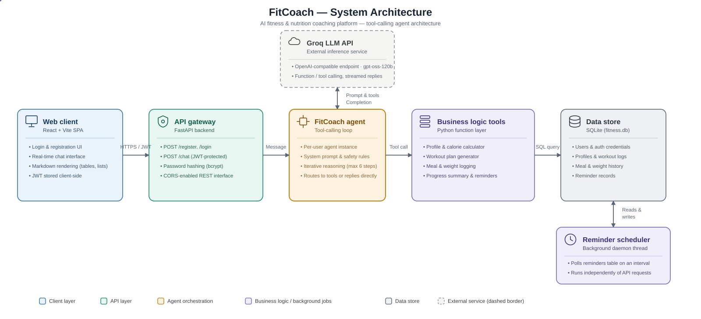

# FitCoach — AI Fitness & Diet Coach

**A tool-calling AI agent that acts as a personal fitness and nutrition coach — calculates calories, builds workout plans, tracks progress, and sends reminders, all through natural conversation.**

[](https://your-live-demo-url.com)
[](#)
[](#)
[](#license)

> Replace the demo badge link above with your actual deployed URL.

---

## Overview

FitCoach is an AI-powered fitness and nutrition coaching agent built on a Python/FastAPI backend, a Groq-hosted LLM, and a React + Vite web frontend. Instead of static forms or fixed calculators, the user simply talks to the agent — it understands the request, decides which tool to call (calorie calculator, workout generator, progress tracker, reminder scheduler), executes real business logic against a database, and replies in natural language.

The project is built around a clean separation of concerns: a stateless chat UI, an authenticated API layer, a per-user agent orchestrator, a business-logic tool layer, and a persistent data store — the same shape used by production LLM-agent systems.

## Problem & Our Solution

| Problem | FitCoach's Solution |
|---|---|
| Generic fitness apps require manual data entry through rigid forms | A conversational interface where users describe their goals in plain language |
| Calorie and macro calculations are confusing for most users | Automated BMR/TDEE calculation using the Mifflin-St Jeor formula, applied per-user |
| Workout plans are often one-size-fits-all | Plans generated dynamically based on the user's stated goal and available days per week |
| People forget to log meals, workouts, or follow through on routines | Built-in logging tools plus a background reminder scheduler that runs independently of the chat session |
| AI fitness bots can overstep into medical advice | A strict safety protocol: the agent pauses and asks clarifying questions on any medical signal, and defers to a licensed professional instead of guessing |
| Multi-user fitness tools often leak data across accounts | JWT-based authentication with per-user agent instances and isolated database rows |

## Key Features & Unique Points

- **Conversational tool-calling agent** — the LLM decides in real time whether to answer directly or invoke a registered Python tool, rather than following a scripted flow
- **Per-user isolation** — every authenticated user gets their own agent instance and tool bindings, so one user's data can never leak into another's session
- **Calorie & macro engine** — BMR/TDEE calculated with the Mifflin-St Jeor formula, adjusted to the user's goal and activity level
- **Dynamic workout plan generator** — weekly splits tailored to fat loss, muscle gain, or general fitness goals
- **Progress tracking** — dedicated logs for workouts, meals, and body weight, summarized on request
- **Independent reminder scheduler** — a background daemon thread checks and fires reminders without blocking the chat API
- **Medical-safety guardrail** — the agent is explicitly instructed to stop, ask, and refer to a professional rather than give unsafe advice
- **JWT authentication** — registration, login, and bcrypt password hashing protect every chat session
- **Clean Markdown-rendered chat UI** — tables, lists, and formatting render properly in the React frontend


## System Architecture



## Setup

### Backend

```bash
cd fitcoach
pip install -r requirements.txt
```

Create a `.env` file (copy `.env.example`) and add your Groq API key:

```
GROQ_API_KEY=your_key_here
```

Run the web backend:

```bash
uvicorn api:app --host 0.0.0.0 --port 8000
```

Or run the CLI version:

```bash
python main.py
```

### Frontend

```bash
cd fitcoach-web
npm install
npm run dev
```

Open `http://localhost:5173` in your browser (make sure the backend is running on port 8000).

## Conclusion

FitCoach demonstrates a complete, production-shaped pattern for building an AI agent product: authenticated multi-user access, a tool-calling orchestration layer, real business logic instead of prompt-only answers, persistent storage, and a background job that runs independently of the request/response cycle. It's a practical starting point for anyone building a domain-specific AI assistant rather than a generic chatbot.

## License

This project is provided as-is for personal and educational use.

---

<p align="center">
  <a href="https://your-live-demo-url.com">
    
  </a>
</p>
